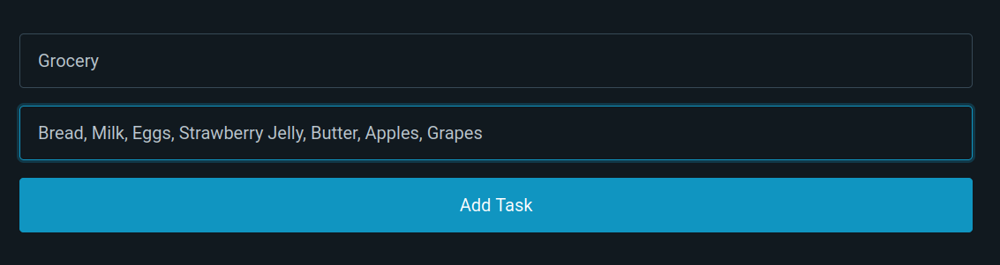

# TASKPINE

## A simple and Minimal Todo App made with [Alpine.js](https://Alpinejs.dev), and [Pico.css](https://picocss.com)

### Table of Contents

1. [General Info](#general-info)
1.1 [The Idea](#the-idea)
1.2 [Future Implementations](#future-implementations)
2. [Technologies](#technologies)
2.1 [Storing the Todos/Tasks](#storing-the-todostasks)
3. [How to use this project](#how-to-use-this-project)
3.1 [Adding a new Todo/Task](#adding-a-new-todo--task)
3.2 [Deleting a Todo/Task](#deleting-a-tasktodo)

----------

## General Info

Taskpine is a simple and Minimal Todo App Project that aims to to bring efficiency and simplicity to it's user without the need of internet or too much procedures.
It's meant to simply do what is intented to do, manage your on-going tasks...

----------

### The Idea

The project itself was created with the intention of testing my knowledge of HTML/CSS and Javascript as well maintaining consistency on github.

### Future Implementations

Currently, the project only allows the user to create and delete todos/tasks, in future versions the user will be able to edit, categorize and filter their todos/tasks.

## Technologies

Taskpine is currently using:

* [Alpine.js](https://Alpine.js.dev)
* [Pico.css](https://picocss.com)

### Storing the Todos/Tasks

To store the user's Todos/Tasks the code uses the localStorage resource contained in most Browsers, allowing the user to close the page or the browser and still maintain it's data.

----------

## Setup

To use this project is simple.
Just download the source code and unzip anywhere you like, and then just open the index.html file in your favorite browser (or drag and drop it).

If you like using the terminal simply do:

```console
cd taskpine
firefox index.html
```

Replacing Firefox with your preferred browser.

As said in [Technologies](#technologies), your Todos/Tasks will be stored in your browser's localStorage and will only be removed if you do it manually.

See no need for fancy stuff, just a browser, you can even use it on your mobile device as the app itself is fully responsive.

----------

## How to use this project

On first opening the project, you will right away see a form for your next Todo/Task.


### Adding a new Todo / Task

Then enter your next Todo/Task info in the fields, and click on the Add Task or press Enter to submit your new Todo/Task.

*The description field is optional, if there's no necessity for a more detailed input you can leave it blank*



And that's it your new todo/task is here.

You can click on the confirm button to mark the todo/task as completed.


### Deleting a Task/Todo

Do remove a Task/Todo from the list (and from the localStorage), just click on the red trash can button, and the task will be removed, and the list updated.
